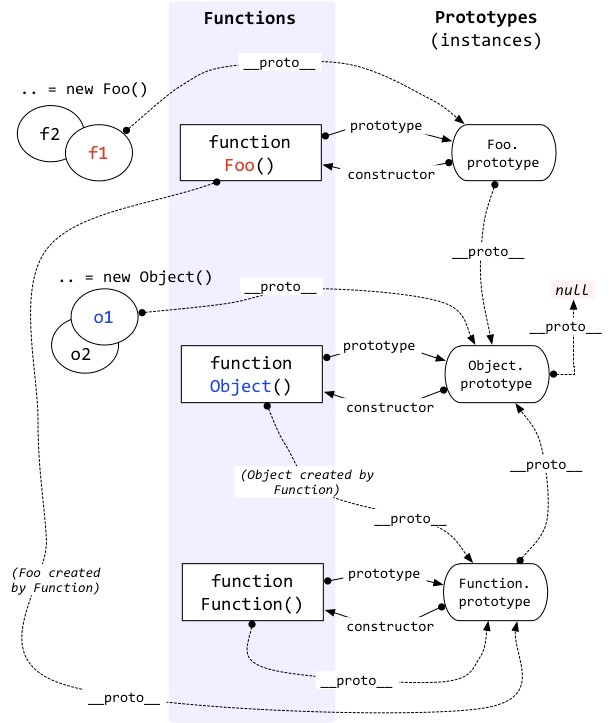

## Prototype

### `new` Operator

```js
new Constructor(...args);
```

```js
function __new__(Constructor, ...args) {
  const instance = Object.create(Constructor.prototype);
  Constructor.apply(instance, args);
  return instance;
}
__new__(Constructor, ...args);
```

### `instanceof`

```js
instance instanceof Constructor;
```

```js
function __instanceof__(instance, Constructor) {
  while (instance !== null) {
    instance = Object.getPrototypeOf(instance);
    if (instance === Constructor.prototype) {
      return true;
    }
  }
  return false;
}
__instanceof__(instance, Constructor);
```

### `class`

```js
class Parent {
  static staticField = 0;
  static staticMethod() {}
  constructor(instanceField) {
    this.instanceField = instanceField;
  }
  instanceMethod = () => {};
  classMethod() {}
}
```

```js
function Parent(instanceField) {
  this.instanceField = instanceField;
  this.instanceMethod = () => {};
}
Parent.prototype.classMethod = function() {};
Parent.staticMethod = function() {};
Parent.staticField = 0;
```

### `extends` and `super`

```js
class Child extends Parent {
  constructor(instanceField) {
    super(instanceField);
  }
  instanceMethod() {
    super.instanceMethod();
  }
}
```

```js
function Child(instanceField) {
  Parent.call(this, instanceField);
}

Object.setPrototypeOf(Child, Parent);
Child.prototype = Object.create(Parent.prototype);
Child.prototype.classMethod = function() {
  Parent.prototype.classMethod.call(this);
};
```

<div align="center">
  
</div>

## Iterable, Iterator, Generator

### Interfaces

```ts
interface Iterator<T> {
  next(): { value: T } | { done: true };
}

interface Iterable<T> {
  [Symbol.iterator](): Iterator<T>;
}

interface IterableIterator<T> extends Iterator<T> {
  [Symbol.iterator](): IterableIterator<T>;
}
```

### Syntaxes expecting iterables

- `for(const item of <iterable>) { }`
- `<iterable>[Symbol.iterator]()`
- `new Set(<iterable>)`
- `new Map(<iterable>)`
- `yield* <iterable>`
- `[...<iterable>]`
- `(...<iterable>)`

> Generators are iterators, iterators are iterable.

### User-defined iterables

```js
const myIterable = {
  *[Symbol.iterator]() {
    yield 1;
    yield 2;
    yield 3;
  }
};

for (let value of myIterable) {
  console.log(value);
}
```
